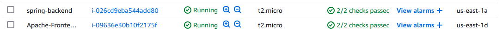

# Secure Application Workshop

Esta aplicación demuestra una implementación segura utilizando Spring Boot para el backend y una interfaz frontend desplegada en Apache. La aplicación implementa autenticación JWT, HTTPS con SSL, y prácticas de seguridad recomendadas.


Despliegue:



## Arquitectura

La aplicación está construida con una arquitectura cliente-servidor:

- Frontend: Aplicación web alojada en Apache (HTML, CSS, JavaScript)
- Backend: API REST desarrollada con Spring Boot con seguridad JWT

## Requisitos

- Java 17 o superior
- Apache HTTP Server
- Certificado SSL (autofirmado para desarrollo, certificado válido para producción)
- Dominio o subdominio (usando DuckDNS u otro proveedor)

## Mejoras futuras

1. Implementar un certificado SSL válido con Let's Encrypt
2. Configurar un nombre de dominio personalizado para el backend
3. Implementar refrescamiento automático de tokens JWT
4. Mejorar la validación de datos en el frontend y backend

## Seguridad

Esta aplicación implementa varias medidas de seguridad:

### Cifrado de comunicaciones
Se habilitó HTTPS en los servidores Apache y Spring Boot, con certificados SSL/TLS de Let's Encrypt. Este protocolo garantiza que todos los datos intercambiados entre usuarios y servidores permanezcan protegidos contra interceptaciones.

### Sistema de identidad
El backend Spring Boot utiliza tokens JWT para la gestión de identidades. Esta tecnología permite administrar sesiones de usuario sin mantener estado en el servidor. Cada token incluye una firma digital que verifica su autenticidad.

### Protección de credenciales
Todas las contraseñas se almacenan de forma segura mediante algoritmos hash de una sola vía. Durante el registro, las credenciales se transforman criptográficamente antes de guardarse, lo que impide recuperar las contraseñas originales aunque se comprometa la base de datos.

### Gestión de permisos
El servidor implementa un sistema robusto de autorización mediante Spring Security. Los recursos y operaciones sensibles están protegidos por reglas que siguen el principio de privilegio mínimo, asegurando que solo usuarios verificados con los permisos adecuados puedan acceder.

### Supervisión continua
El backend mantiene registros detallados de eventos críticos como intentos de acceso, fallos de autenticación y uso de recursos protegidos. Esta información facilita la identificación de incidentes y permite auditar el funcionamiento del sistema.

## Ejecución de pruebas

```mvn test```


## Autor

- **Juan Pablo Daza Pereira** ([JuanPabl07DP](https://github.com/JuanPabl07DP))
